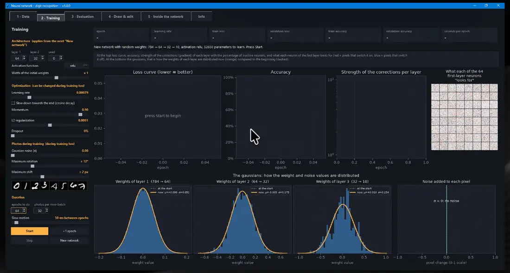
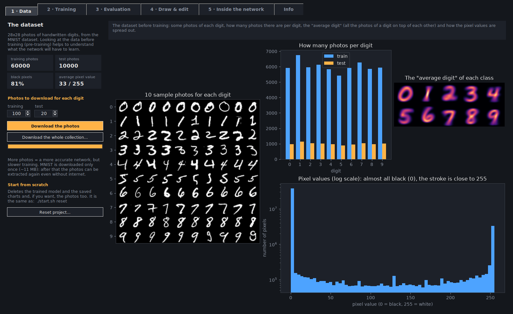
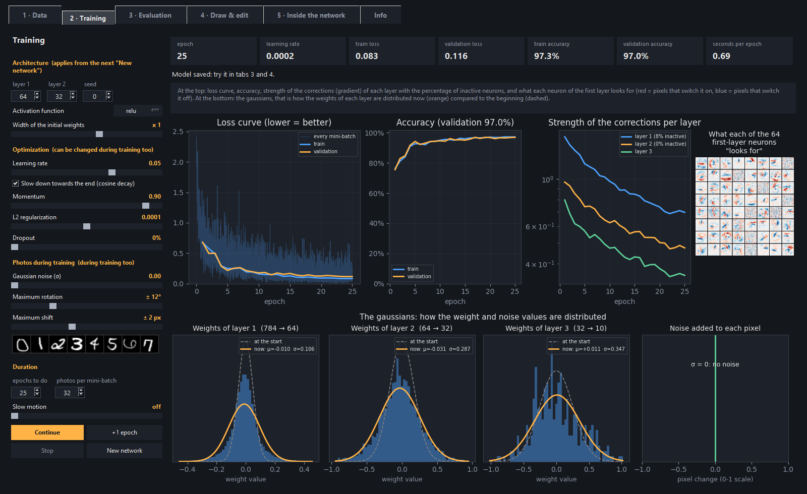
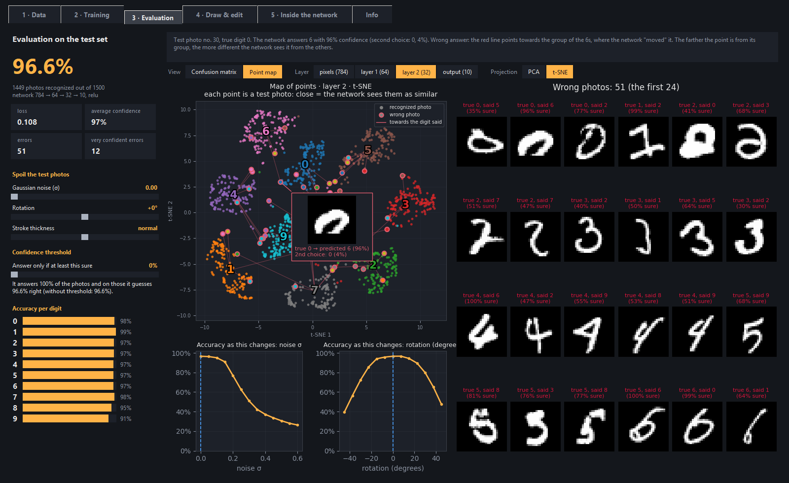
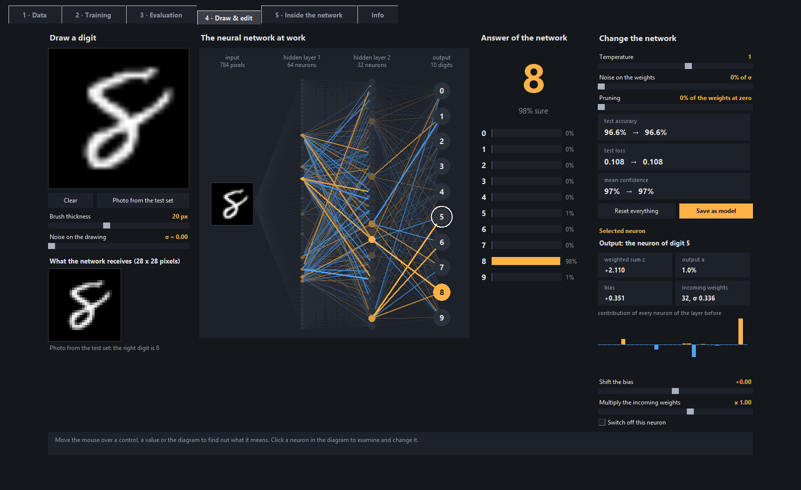
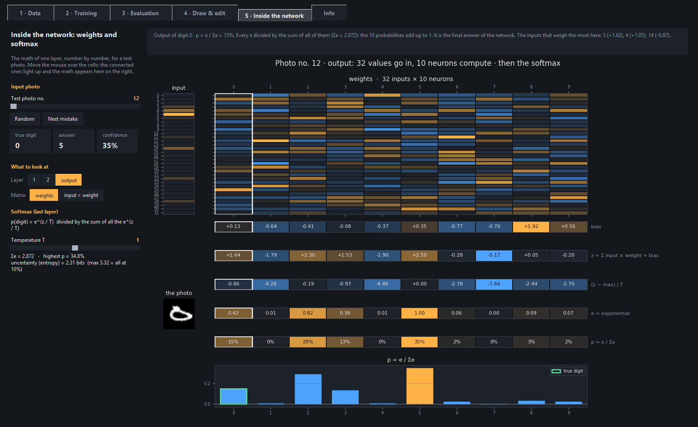
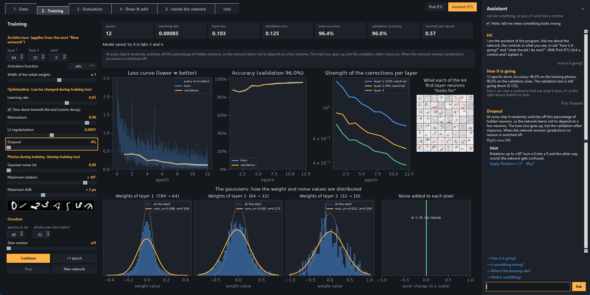

<h1 align="center">🧠 Neural network from scratch</h1>

<p align="center"><strong>Handwritten digit recognition in pure Python + NumPy — watch the network learn, tweak it while it learns, and get your hands inside it.</strong></p>

<p align="center">
  
</p>

<p align="center">
  <a href="https://github.com/dev-luigi/neural-network-digits/actions/workflows/ci.yml"></a>
  <a href="https://github.com/dev-luigi/neural-network-digits/releases/latest"></a>
  <a href="https://www.python.org/"></a>
  <a href="https://numpy.org/"></a>
  <a href="https://matplotlib.org/"></a>
  <a href="https://docs.pytest.org/"></a>
  
  
  <a href="LICENSE"></a>
</p>

<p align="center">
  <a href="#features">Features</a> •
  <a href="#quick-start">Quick Start</a> •
  <a href="#tech-stack">Tech Stack</a> •
  <a href="#from-the-terminal">Terminal</a> •
  <a href="#experiments-to-try">Experiments</a> •
  <a href="#development">Development</a>
</p>

A small neural network written **from scratch in Python + NumPy** (no PyTorch or TensorFlow) that learns
to recognize the handwritten digits of the MNIST dataset, with an **educational graphical interface** to
watch it learn, change its parameters while it learns and get your hands inside the trained network.
The interface is available in English and Italian (the **EN | IT** selector at the top right, next to Pick).

---

## Features

- **The network, line by line**: forward, softmax, cross-entropy, backpropagation, SGD with momentum,
  L2, dropout, 4 activation functions. All in a file of ~140 lines, commented in simple English
  ([`neural_net/network.py`](neural_net/network.py)).
- **Every step**: downloading the data, exploring it before training, training, evaluating, experimenting.
- **An interface with 5 tabs**, with dozens of knobs and an explanation for every control (just
  hover it with the mouse).
- **A built-in assistant, without AI models**: it answers questions looking at the real state of the network,
  explains any control you click and tells you when something looks wrong, with a fix to apply in one click.
- **From the terminal too**: downloading, exploring, training, evaluating and the drawing board are also
  commands.
- **Automatic updates** from the GitHub releases, with one click.

### 1 · Data — the pre-training
How many photos to download (or the whole collection: all the 70,000 photos of MNIST, after a window that tells
you how much space they take), what the dataset looks like before training (examples, photos per digit,
"average digit", pixel values) and the project reset.



### 2 · Training — watch it learn
Loss curve (for every mini-batch and for every epoch), accuracy, strength of the corrections per layer with the
inactive neurons, what every neuron of the first layer "looks for" and **the gaussians** of the weights (now
compared with the start) and of the noise.

- **Architecture**: neurons per layer, activation function (relu, leaky relu, sigmoid, tanh),
  width of the initial weights, seed.
- **Optimization**, which can be changed during training too: learning rate with
  *cosine decay*, momentum, L2, dropout, mini-batch.
- **Photos**, these too can be changed during training: gaussian noise, random rotation and shift, with
  preview.
- **Control**: pause, "+1 epoch" and slow motion.



### 3 · Evaluation — confusion matrix and points map
Accuracy on photos never seen before. The photos can be "damaged" (noise, rotation, stroke thickness)
and you can set a confidence threshold: below it the network says "I don't know", and you see how many
photos it still answers and how many of those it gets right. There are also the robustness curves and the
wrong photos.

The big chart switches from the **confusion matrix** to the **points map**: every photo is a point
on a plane (PCA or t-SNE, written in NumPy), layer by layer. You can see the digits separate, and when you
hover a point with the mouse the photo and the answer of the network show up.



### 4 · Draw & edit — the lab
You draw a digit and see the neurons light up. Click a neuron to see weighted sum, output,
bias and weights, and you can shift its bias, multiply its weights or switch it off. There are also global
knobs (temperature, noise on the weights, pruning), and the effect on the test accuracy shows up right away.
The edited network can be saved.



### 5 · Inside the network — the math, cell by cell
The math of a layer number by number, with colored cells like in the "LLM visualizers":
- the input values and the weight matrix (or input × weight);
- the bias, the weighted sum and the activation;
- for the last layer, the **softmax steps** (z − max, exponential, division by the sum), with
  the **temperature** knob.

When you hover a cell, the connected ones light up and the math is explained.



### The assistant — ask, pick, hints
A side panel (**F2**, or the *Assistant* button at the top right) that knows the program and sees what is
happening in it:

- **Questions**, in English or Italian: "what is overfitting?", "how is it going?", "what should I do now?",
  "is something wrong?". The answers use the real state of the open tab: the epochs done, the accuracy, the
  learning rate in use, the photos downloaded, the drawing on the board. Every answer also says where to see
  that thing in the program and suggests an experiment to try.
- **Pick** (**F1**): hover the controls and they get an orange frame; click one and the assistant explains what it
  does and what it is worth now. The charts are picked one at a time (the loss curve, one gaussian, one wrong
  photo, one row of the math...), and so are the tiles with the numbers. While Pick is on, the clicks do not
  reach the controls, so nothing starts by mistake.
- **Hints** (they can be switched off): the assistant notices the most common mistakes, like a learning rate
  that is too high (the network explodes or does not learn), overfitting, too many inactive neurons, extreme
  settings, or test photos spoiled much more than the training ones. Each hint has an *Apply* link that
  fixes it in one click and a *Why?* link that explains the concept behind it.

It is not a language model, on purpose: the answers come from a small search engine (TF-IDF, written in NumPy
in [`assistant/search.py`](assistant/search.py)) over a glossary of neural networks and the explanations of
the controls, and the hints are simple rules ([`assistant/rules.py`](assistant/rules.py)). It needs nothing
to download, it answers in a moment and it never makes things up about the numbers it reads.



---

## Quick Start

You need **Python 3.9 or newer**. Download the zip of the latest version from the
[Releases](https://github.com/dev-luigi/neural-network-digits/releases/latest) page and extract it.

**Windows**: double-click **`start.bat`**. The first time it installs the libraries by itself (numpy, pillow,
matplotlib), then it opens the interface.

**Linux and macOS**: open a terminal in the extracted folder and run **`./start.sh`**. The first time it
creates a virtual environment in `.venv` and installs the libraries there (the Python of the system is not
touched), then it opens the interface. It needs Tkinter and venv: if one is missing, `start.sh` tells you
what to install.

| System | Once, before the first start |
|---|---|
| Ubuntu / Debian | `sudo apt install python3-venv python3-tk` |
| Fedora | `sudo dnf install python3-tkinter` |
| Arch | `sudo pacman -S tk` |
| macOS | Python from [python.org](https://www.python.org/downloads/macos/) (Tkinter included; the Python that comes with macOS has a Tkinter that is too old) |

Tested on Windows 11, Ubuntu 24.04, Debian 12, Fedora 44 and Arch Linux; on macOS the automatic tests
and `start.sh` run at every push (CI).

**At the first start** the `data/` folder is empty:

1. in the **1 · Data** tab press *Download the photos* (MNIST, ~11 MB, only once);
2. in the **2 · Training** tab press *Start*: with the starting settings (1000 photos,
   60 epochs) it takes less than half a minute and gets to about 91% on the test photos.
   With more photos (for example 700 per digit) it gets to about 96%, and with the whole collection
   (60,000 photos) to about 98.5%, but the training takes about 5 minutes.

### Updates

Every time the interface opens, the program asks GitHub whether a new version is out (you can turn this
off in the **Info** tab). If there is one, it shows the changes and offers:
- **Update now**: downloads the new version, replaces the program files and restarts. The
  `data/` folder (photos, model, settings) is not touched, and if something goes wrong
  the old files are put back.
- **Later** or **Skip this version**.

From the terminal it is `start.bat update` (on Linux and macOS `./start.sh update`). If you downloaded the project
with `git clone`, update with `git pull` instead.

---

## Tech Stack

| Component | Technology |
|---|---|
| Neural network | Python / NumPy — written from scratch, no ML framework |
| Interface | Tkinter |
| Charts | matplotlib (loss, gaussians, confusion matrix, PCA / t-SNE map) |
| Images | Pillow |
| Dataset | MNIST (downloaded by the program from the Data tab, not in the repository) |
| Languages | English / Italian (`i18n.py` + `locales/it.json`) |
| Tests | pytest (headless on Linux with xvfb) |
| CI/CD | GitHub Actions — tests on Windows, Linux and macOS, automatic releases from tags |

---

## From the terminal

The same steps, without the interface (on Linux and macOS: `./start.sh` instead of `start.bat`):

```text
start.bat download --per-digit 100       1. downloads the photos (with --all the whole collection)
start.bat explore                        2. pre-training: charts about the dataset
start.bat train    --epochs 60 --lr 0.05 3. trains (also --noise --dropout --activation tanh ...)
start.bat evaluate --noise 0.3           4. tests on the test photos (also --rotation --thickness --map t-SNE)
start.bat draw                           5. only drawing board and lab
start.bat reset    [--all]               deletes model and charts (with --all the photos too)
start.bat update                         checks whether there is a new version and installs it
start.bat --version                      shows the installed version
```

`start.bat train --help` shows all the options. The charts are saved in `data/charts/`.

---

## How the network works, in short

```text
784 pixels  →  64 neurons  →  32 neurons  →  10 outputs (one per digit)
```

1. **Forward**: every neuron makes a weighted sum of its inputs plus a bias (z) and applies
   the activation (a). The last layer turns the 10 scores into probabilities with the **softmax**.
2. **Loss**: the cross-entropy measures how low the probability given to the right digit is.
3. **Backpropagation**: from the output back to the input, it computes how much every weight contributed
   to the error, and corrects it a little (gradient descent with momentum).
4. **The gaussians**: at the start the weights are random numbers taken from a gaussian (He initialization
   for relu and leaky relu, LeCun for sigmoid and tanh); during training their distribution widens and
   changes shape.

---

## Experiments to try

- **Learning rate at 1**: the network stops learning. Look at the inactive neurons and at the
  gaussians that widen out of all proportion.
- **Sigmoid with 2 layers**: it learns more slowly. Look at the strength of the corrections of the first layer.
- **Initial width x0.1 and x5**: the signal dies out or explodes.
- **Noise 0 versus noise 0.3 in training**: train with noise 0 and try the damaged photos in the
  Evaluation tab, then train again with noise 0.3 and compare.
- **Maximum rotation 0 versus 30°**, then evaluate with the rotation at 25°.
- **Dropout 50%**: the train loss goes up. And the validation one?
- **Softmax and temperature**: in the Inside the network tab, with "Next mistake" find an uncertain photo,
  then set the temperature to 0.1 and to 10. Does the answer change?
- **Points map layer by layer** (pixels → layer 1 → layer 2 → output): watch the groups
  of digits separate. Then raise the noise: where do the points end up?
- **In the lab**:
  - switch off the most active neurons while you draw a 7, until the answer changes;
  - prune 90% of the weights;
  - raise the temperature (the answer does not change, the confidence does).

---

## Development

### Setup and tests

```bash
git clone https://github.com/dev-luigi/neural-network-digits.git
cd neural-network-digits
git checkout develop

pip install -r requirements.txt -r requirements-dev.txt
python -m pytest
python start.py
```

On Linux and macOS let `./start.sh` create the `.venv` with the libraries, then use its Python:
`.venv/bin/python -m pip install -r requirements-dev.txt` and `.venv/bin/python -m pytest`.

The tests check:
- backpropagation, compared with the gradient computed numerically;
- learning with all the activations, and the softmax;
- the saving of the photos and their quick copy, the preparation of the photos and all the charts;
- the install of updates: `data/` is not touched, dangerous zips are refused
  and the old files go back in place if something goes wrong;
- the release tool: the version and the changes in CHANGELOG.md;
- the translations: every text has its Italian version;
- the opening of all the tabs of the interface.

### Publishing a new version

Versions follow [semantic versioning](https://semver.org/) `MAJOR.MINOR.PATCH`:
- **PATCH** to fix bugs;
- **MINOR** for new features;
- **MAJOR** for changes that break something (for example saved models that are no longer compatible).

On the `develop` branch:

```bash
python tools/release.py prepare 1.1.0   # changes the version and opens the paragraph in CHANGELOG.md
# ...write the changes in CHANGELOG.md, commit, push and merge develop into main with a pull request...
```

Then, from the `main` branch:

```bash
python tools/release.py publish         # tests, tag v1.1.0 and push: the CI/CD does the rest
```

---

## Project Structure

```
neural-network-digits/
├── start.bat              # double-click = graphical interface (Windows)
├── start.sh               # ./start.sh = graphical interface (Linux, macOS), in its own .venv
├── start.py               # the one starting point: interface or a step from the terminal
├── requirements.txt       # the libraries: numpy, pillow, matplotlib (requirements-dev.txt: pytest)
├── project.py             # name, version, author and GitHub addresses of the program
├── updater.py             # check and install of new versions from GitHub
├── i18n.py                # languages: tr() gives every text in the chosen language
├── locales/it.json        # the Italian translations
├── CHANGELOG.md           # the changes of every version
├── LICENSE                # MIT
├── neural_net/            # the "brain", without windows
│   ├── network.py         #   forward, softmax, loss, backpropagation (read this first!)
│   ├── data.py            #   photos: download, loading, preparation, noise, alterations
│   ├── training.py        #   the training loop, one epoch at a time, and the tests on the test photos
│   ├── charts.py          #   all the charts (loss, gaussians, confusion, points map, softmax...)
│   └── storage.py         #   where the files are saved, and the reset
├── assistant/             # the assistant, without windows
│   ├── brain.py           #   how it answers a question, looking at the state of the program
│   ├── knowledge.py       #   the glossary, what every tab shows, the experiments to try
│   ├── rules.py           #   the hints: the rules that notice the common mistakes
│   └── search.py          #   the small search engine (TF-IDF with NumPy)
├── gui/                   # the window (Tkinter + matplotlib)
│   ├── window.py          #   the window with the 5 tabs and the Info tab
│   ├── tab_*.py           #   one tab per file (tab_info.py also offers the updates)
│   ├── drawing_board.py   #   the drawing board and the diagram of the network (tab 4)
│   ├── lab.py             #   the changes to the trained network (tab 4)
│   ├── assistant.py       #   the assistant panel (F2)
│   ├── pick.py            #   Pick (F1): click a control to have it explained
│   ├── app_state.py       #   the state of the program, in a dictionary for the assistant
│   └── base.py            #   colors and pieces of interface reused by all the tabs
├── docs/                  # the screenshots of this README
├── tests/                 # the automatic tests (pytest)
├── tools/release.py       # to publish a new version
├── .github/workflows/     # the CI/CD: tests at every push, release at every tag
└── data/                  # created by the program: photos, model, charts, settings (excluded from git)
```

The logic (`neural_net/`) does not depend on the interface: both the tabs and the terminal commands use it.

---

## Data

The photos come from the [MNIST](https://yann.lecun.com/exdb/mnist/) dataset by Yann LeCun, Corinna Cortes and
Christopher J.C. Burges, distributed under the
[CC BY-SA 3.0](https://creativecommons.org/licenses/by-sa/3.0/) license. The program downloads them from the
public copy used by Keras/TensorFlow and does not include them in the repository.

---

## License

The code is distributed under the [MIT](LICENSE) license.

---

## Author

**Luigi Tanzillo** — [luigitanzillo.it](https://luigitanzillo.it) · [github.com/dev-luigi](https://github.com/dev-luigi)

---

## Star History

<a href="https://www.star-history.com/?repos=dev-luigi%2Fneural-network-digits&type=date&legend=top-left">
 <picture>
   <source media="(prefers-color-scheme: dark)" srcset="https://api.star-history.com/chart?repos=dev-luigi/neural-network-digits&type=date&theme=dark&legend=top-left" />
   <source media="(prefers-color-scheme: light)" srcset="https://api.star-history.com/chart?repos=dev-luigi/neural-network-digits&type=date&legend=top-left" />
   
 </picture>
</a>
